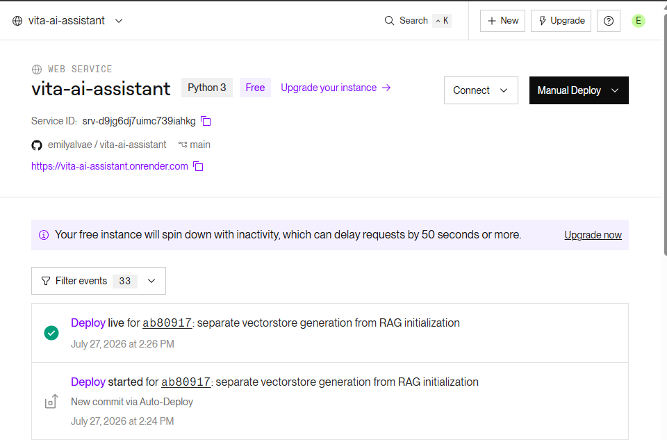
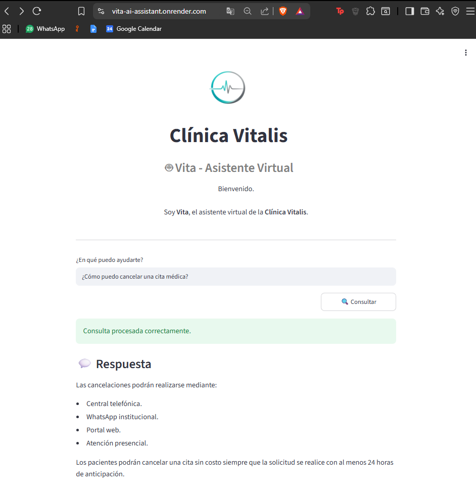

# Vita AI Assistant 🏥🤖

**Vita AI Assistant** es un asistente inteligente desarrollado con Inteligencia Artificial que permite responder preguntas en lenguaje natural sobre la documentación de una clínica ficticia llamada **Clínica Vitalis**.

El proyecto implementa una arquitectura **Retrieval-Augmented Generation (RAG)** junto con **LangGraph** para recuperar información relevante desde documentos PDF y generar respuestas precisas utilizando **Google Gemini**.

Este proyecto fue desarrollado como solución al **Challenge Final – Alura Agentes IA**.

---

# Objetivo

Facilitar el acceso a la información institucional de la clínica mediante un asistente capaz de responder preguntas relacionadas con:

* Especialidades médicas
* Servicios disponibles
* Agendamiento, reprogramación y cancelación de citas
* Atención al paciente
* Políticas internas
* Información contenida en documentos oficiales

---

# Arquitectura

El flujo general del sistema es el siguiente:

```text
Usuario
    │
    ▼
Interfaz Streamlit
    │
    ▼
LangGraph
    │
    ├── Triaje
    ├── Resolución mediante RAG
    ├── Solicitud de información adicional
    └── Apertura de ticket
            │
            ▼
Retriever
            │
            ▼
FAISS Vector Store
            │
            ▼
Google Gemini
            │
            ▼
Respuesta al usuario
```

---

# Tecnologías utilizadas

* Python
* Streamlit
* LangChain
* LangGraph
* Google Gemini
* FAISS
* PyMuPDF
* Python Dotenv

---

# Estructura del proyecto

```text
vita-ai-assistant/
│
├── app/
│   ├── agents/
│   ├── loaders/
│   ├── rag/
│   ├── utils/
│   └── config.py
│
├── documents/
├── vectorstore/
├── streamlit_app.py
├── build_vectorstore.py
├── requirements.txt
├── README.md
└── .env
```

---

# Funcionalidades

* Lectura automática de documentos PDF.
* División de documentos en fragmentos (chunks).
* Generación de embeddings.
* Almacenamiento vectorial mediante FAISS.
* Recuperación semántica de información (RAG).
* Agente inteligente construido con LangGraph.
* Clasificación de consultas mediante un nodo de triaje.
* Respuestas generadas con Google Gemini.
* Interfaz web desarrollada con Streamlit.

---

# Instalación

### 1. Clonar el repositorio

```bash
git clone https://github.com/emilyalvae/vita-ai-assistant.git
cd vita-ai-assistant
```

### 2. Crear un entorno virtual

```bash
python -m venv .venv
```

### 3. Activar el entorno

Windows

```bash
.venv\Scripts\activate
```

Linux / macOS

```bash
source .venv/bin/activate
```

### 4. Instalar dependencias

```bash
pip install -r requirements.txt
```

---

# Variables de entorno

Crear un archivo `.env` con la siguiente variable:

```env
GEMINI_API_KEY=TU_API_KEY
```

---

# Generación del vectorstore

La generación de embeddings se realiza una sola vez mediante:

```bash
python build_vectorstore.py
```

Esto crea el índice vectorial utilizado posteriormente por el asistente.

---

# Ejecutar la aplicación

```bash
streamlit run streamlit_app.py
```

---

# Ejemplos de consultas

El asistente puede responder preguntas como:

* ¿Qué especialidades médicas ofrece la clínica?
* ¿Cómo puedo cancelar una cita médica?
* ¿Cuál es el horario de atención?
* ¿Qué documentos debo presentar para mi primera consulta?
* ¿Cómo funciona la reprogramación de citas?

---

# Capturas de pantalla

### Aplicación desplegada

La aplicación se encuentra publicada en la nube mediante Render.



---

### Ejemplo de consulta

El asistente responde preguntas en lenguaje natural utilizando la información recuperada desde los documentos de la Clínica Vitalis mediante RAG.



---

## Deploy

La aplicación se encuentra desplegada públicamente en **Render**, permitiendo acceder al asistente desde un navegador web sin necesidad de realizar una instalación local.

**URL de la aplicación:**

`https://vita-ai-assistant.onrender.com/`

Durante el desarrollo del proyecto se consideró **Oracle Cloud Infrastructure (OCI)** como plataforma de despliegue, siguiendo las recomendaciones del challenge. Sin embargo, para esta entrega se optó por **Render**, ya que permitió realizar un despliegue estable y accesible para la demostración del funcionamiento del asistente. La arquitectura del proyecto es compatible con un futuro despliegue en OCI si se desea migrar la solución.

---

# Autor

**Emily Alva**

Proyecto desarrollado como parte del **Challenge Final – Alura Agentes IA**.
